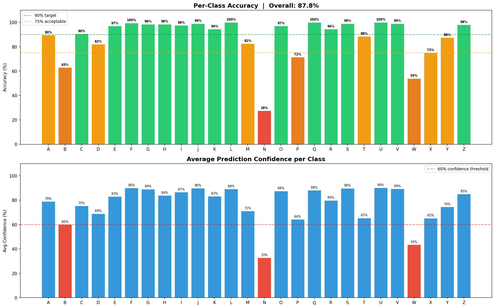
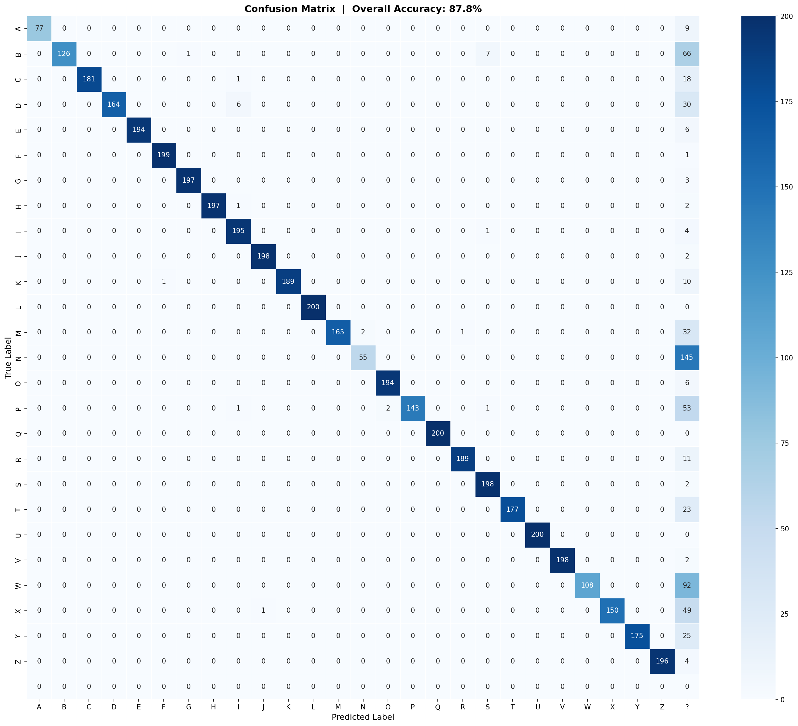

## 📊 Results

### 🔹 Accuracy Report
Shows per-class accuracy along with confidence distribution across all 26 ISL alphabets.

---

### 🔹 Confusion Matrix
Visualizes misclassifications between similar gestures (e.g., H, N, M), helping identify model weaknesses.

